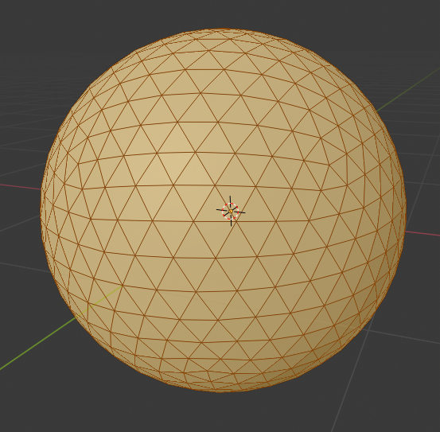
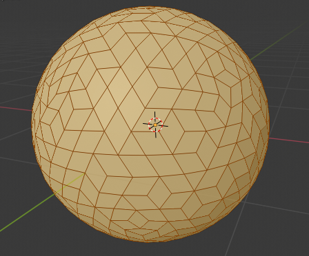
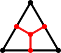
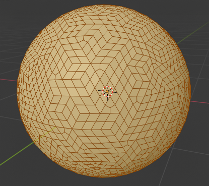
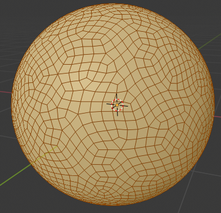

I recently created a tweet about creating an organic looking quad mesh on a sphere and it got rather popular.

<blockquote class="twitter-tweet" data-dnt="true">
I managed to apply <a href="https://twitter.com/OskSta?ref_src=twsrc%5Etfw">@OskSta</a>&#39;s amazing organic quad grid generation to a sphere! Not sure yet if I should do anything with it 🤔 <a href="https://twitter.com/hashtag/GodotEngine?src=hash&amp;ref_src=twsrc%5Etfw">#GodotEngine</a> <a href="https://t.co/sqA35TQCaf">pic.twitter.com/sqA35TQCaf</a>
&mdash; CaptainProton42 (@CaptainProton42) <a href="https://twitter.com/CaptainProton42/status/1325752495235330049?ref_src=twsrc%5Etfw">November 9, 2020</a></blockquote> 

Since I got some feedback and people asking me how I achieved this, I decided to give some more context. Don't expect a full-on tutorial here on how to do this in the engine of your choice. Instead, this is supposed to give you some more background and tricks on how to achieve something like this and explain some of the (suprisingly simple) theory. I will attempt to cover the grid generation itself as well as give a brief introduction to marching squares.

As is probably already clear to you, this is directly based on a grid generation algorithm that [Oskar Stålberg](https://twitter.com/osksta) posted on Twitter a while ago and which he uses in his sandbox town building game [Townscaper](https://store.steampowered.com/app/1291340/Townscaper/). He has also written a very in-depth post on the process of building the tech behind Townscaper on [imgur](https://imgur.com/gallery/i364LBr).

<blockquote class="twitter-tweet" data-conversation="none" data-dnt="true">
I present:  Fairly even irregular quads grid in a hex  Todo:  1. Heuristic to reduce (or eliminate) 6 quad verts 2. Tile these babies to infinity <a href="https://t.co/o0kU68uovZ">pic.twitter.com/o0kU68uovZ</a>
&mdash; Oskar Stålberg (@OskSta) <a href="https://twitter.com/OskSta/status/1147881669350891521?ref_src=twsrc%5Etfw">July 7, 2019</a></blockquote> 
  

To summarize the algorithm:

1. Start with a triangulation (in this case triangles in a hexagon)
2. Remove random edges triangles to create quads (we will now have a grid consisting of mostly quads but also some triangles)
3. Subdivide *all quads and triangles* into new quads
4. Relax the mesh to make it look more natural

So now that we know the basic algorithm for meshes in a plane, what do we need to do to adapt it for a sphere?

The surprisingly simple answer is: *nothing*.

For the slightly more complicated answer, keep reading.

## Grid Generation

### Step 1: Triangulation

The first step of the algorithm requires a triangulation. What is a triangulation? Well, there are many definitions (including but not limited to tracking bad guys in police crima drama series) but in our case we will define it as surface triangulation which, in the words of [Wikipedia](https://en.wikipedia.org/wiki/Surface_triangulation), is "a net of triangles, which covers a given surface partly or totally". In the tweet above we start with the triangulation of a hexagon but we can triangulate any surface, really.

A popular triangulation of the surface of a sphere is the so-called [icosphere](https://en.wikipedia.org/wiki/Geodesic_polyhedron). It is, of course, not the only triangulation but it has some nice properties including the fact that all triangles have the same size.

{{ site.beginInfoBox }}
{{ site.beginInfoBoxTitle }}
Which Software Should You Use?
{{ site.endInfoBoxTitle }}
I am doing all the grid generation in Blender, mainly because Blender's `bmesh` [module](https://docs.blender.org/api/current/bmesh.html) is a breeze to work with and already has most operations (like removing edges, subdividing faces, etc.) defined. Of course, you can do this using whichever software or tool you want and even directly in-engine for grid generation on the fly.
{{ site.endInfoBox }}

Below is an image of our starting icosphere in Blender:

{{ site.beginFigure }}

{{ site.beginCaption }}
Our starting triangulation, the icosphere.
{{ site.endCaption }}
{{ site.endFigure }}

### Step 2: Removing Edges

Removing edges is relatively straightforward. However, we need to be careful to keep track of which edges we have already removed as to not accidentally remove an edge of an already quad face: When we remove an edge, we can't remove the edges of the two now merged faces either. I solved this by keeping track of a separate set of edges that are stil "available" and only removing edges listed in it from the mesh. If we did everything right, our former icosphere should now look something like this:

{{ site.beginFigure }}

{{ site.beginCaption }}
The mesh after the edge removal step.
{{ site.endCaption }}
{{ site.endFigure }}

### Step 3: Subdivide Faces

We are currently facing one problem: Our result should be a *quad* mesh, that is, a mesh consisting only of faces with four corners. But there are still some triangles left in our current mesh. Luckily, triangles can easily subdivided into three smaller quads from the middle of each edge. In the same way, the already existing quads can be subdivided into four smaller quads. By doing this, we thus end up with a mesh consisting *only* of quads.

{{ site.beginFigure }}
 
{{ site.beginCaption }}
Subdividing a quad and a triangle into smaller quads.
{{ site.endCaption }}
{{ site.endFigure }}

Done correctly, our mesh now looks like this:

{{ site.beginFigure }}

{{ site.beginCaption }}
The mesh with all faces subdivided into quads.
{{ site.endCaption }}
{{ site.endFigure }}

### Step 4: Mesh Relaxation

We are now almost where we want to be but the mesh does not look very organic yet. This is where the mesh relaxation comes in. For me, this was the most tricky step since it involved some experimentation to get it to look right.

In the simpler case of a mesh in a plane, there are some ressources available which outline possible relaxation methods, like [this article](https://andersource.dev/2020/11/06/organic-grid.html) from andersource.dev, but most of them seem to involve [letting each quad force its vertices into a square](https://twitter.com/OskSta/status/1147946734326288390).

I see no reason why an approach like this shouldn't work on a spherical mesh as well. However, I approached the problem from a slightly different angle and started with [Laplacian smoothing](https://en.wikipedia.org/wiki/Laplacian_smoothing) which is generally used to make meshes smoother. In the end I needed to augment this by adding forces which try to prevent too small/large and thin quads as well. There are probably many good ways too relax the mesh but some good guidelines should be:

* each quad should be as square as possible
* all quads should have approximately the same area
* or any similar criteria

Using my approach, the final result looks like this:

{{ site.beginFigure }}

{{ site.beginCaption }}
✨ The final mesh! ✨
{{ site.endCaption }}
{{ site.endFigure }}

## Bonus: Tiles and Marching Squares

So now we have our mesh. But what can we actually do with it? I decided to go for a *very* minimalistic Townscaper clone which uses the sphere mesh for building. Call it *SphereScaper* or an equally creative name.

One advantage of the quad mesh is, that we can place deformed square tiles at each quad. The math for this is relatively simple. We only need to deform our mesh in the $$x$$- and $$y$$-directions (assuming $$z$$ is up) since we can just extrude the $$z$$ component along the quads normal vector.

Now let's assume that our tiles' corner points are $$\vec{a} = (0, 0)$$, $$\vec{b} = (1, 0)$$, $$\vec{c} = (0, 1)$$ and $$\vec{d} = (1, 1)$$ (that is, our tile is a *unit square*). A arbitrary quad on our mesh is defined by four vertices in 3D space, let's call them $$\vec{a}'$$, $$\vec{b}'$$, $$\vec{c}'$$ and $$\vec{c}'$$.

Then, each coordinate $$\vec{p} = (x, y)$$ in the original tile can be described by the bilinear parametrisation

$$\begin{align}
  \vec{p} &= (1 - x) \cdot (1 - y) \cdot \vec{a} + x \cot (1 - y) \cdot \vec{b}) + (1 - x) \cdot y \cdot \vec{c} + x \cdot y \cdot \vec{d}
          &= \vec{a} + x \cdot (1 - y) \cdot (\vec{b} - \vec{a}) + (1 - x) \cdot y \cdot (\vec{c} - \vec{a}) + x \cdot y \cdot (\vec{d} - \vec{a})
\end{align}$$

We can easily transform this parametrisation to the new quad

$$\begin{align}
  \vec{p}' &= \vec{a}' + x \cdot (1 - y) \cdot (\vec{b}' - \vec{a}') + (1 - x) \cdot y \cdot (\vec{c}' - \vec{a}') + x \cdot y \cdot (\vec{d}' - \vec{a}')
\end{align}$$

where $$\vec{p}'$$ is the resulting coordinate.

{{ site.beginInfoBox }}
{{ site.beginInfoBoxTitle }}
Storing and Loading the Grid
{{ site.endInfoBoxTitle }}
In case you are not generating the grid on the fly
{{ site.endInfoBox }}
